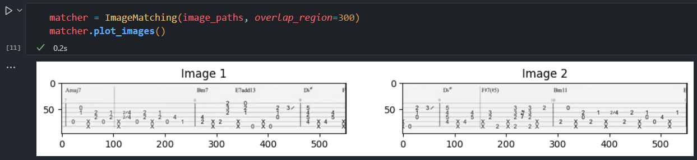
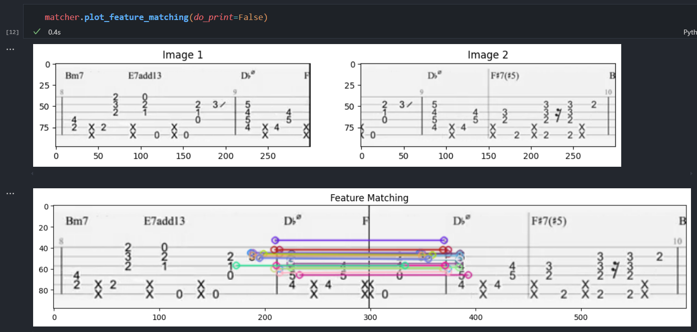
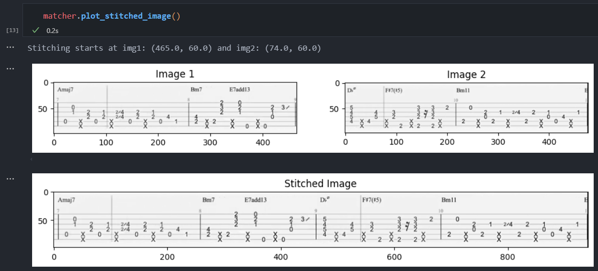

# Video Processing and Image Sanitization

This project captures screenshots from a YouTube video at specified intervals and processes the images. The main functionality is provided by three classes: `VideoToImages`, `ProcessImages`, and `ImageMatching`.

## Features

#### Video and Image Processing

- Capture screenshots from a YouTube video at specified intervals.
- Sanitize images by removing blank screens.
- Interactive selection of cropping area.
  
- Crop all images to the specified area.
- Convert cropped images to grayscale.
- Remove duplicate images based on a similarity threshold.

#### Image Matching

Stitch consecutive images together based on feature matching.

- Original Images: 
- Feature Matches: 
- Stitched Image: 

## Installation

1. Clone the repository:

   ```sh
   git clone https://github.com/h4ppyturt1e/youtubeScreenshotTool.git
   cd youtubeScreenshotTool
   ```

2. Install the required packages:

   <sub> Note: Tested on Python 3.11.1, most likely will work down to at least 3.7

   ```sh
   pip install -r requirements.txt
   ```

## Usage

#### Arguments

- `youtube_url`: URL of the YouTube video.
- `interval`: Interval in seconds for capturing screenshots.
- `output_name`: Name of the output directory.
- `--gray`: Optional. Do grayscale conversion (0 or 1).
- `--sim`: Optional. Similarity level for removing duplicates (0.0 to 1.0). Default is 0.8.
- `--unique`: Optional. Removes duplicate images (0 or 1).
- `--start-time`: Optional. Start capturing at a specified time (MM:SS)
- `--end-time`: Optional. End capturing at a specified time (MM:SS)

1. Run the script with the required arguments:

   ```sh
   python main.py <youtube_url> <interval> <output_name> [--gray <0 or 1>] [--sim <similarity_level>] [--unique <0 or 1>] [--start-time <MM:SS>] [--end-time <MM:SS>]
   ```

   For example:

   ```sh
   python main.py "https://www.youtube.com/watch?v=ZrV8YYwKvSs" 2 "remember_me_coco" --gray 1 --unique 1 
   ```

   Output:
   

## Contributing

Contributions are welcome! Please fork the repository and submit a pull request for any improvements or bug fixes.

## License

See the [LICENSE](LICENSE) file for license rights and limitations (MIT).
