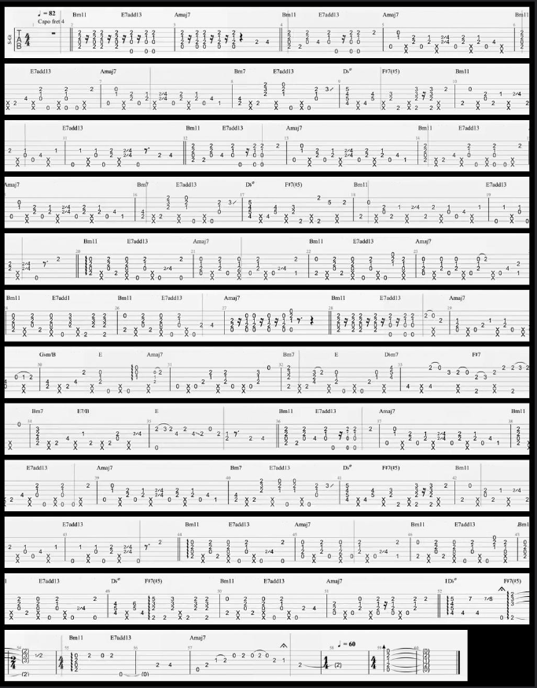

# Video Processing and Image Stitching Tool

This project captures screenshots from a YouTube video at specified intervals, processes the images, then stitches it into a combined image. 

The main functionality is provided by four classes: `VideoToImages`, `ProcessImages`, `ImageMatching`, and `StitchDirectory`.

## Features

#### Video and Image Processing

- Capture screenshots from a YouTube video at specified intervals.
- Sanitize images by removing blank screens.
- Interactive selection of cropping area. <br>

- Crop all images to the specified area.
- Convert cropped images to grayscale.
- Remove duplicate images based on a similarity threshold.

#### Image Matching and Stitching

Stitch consecutive images together based on feature matching.

- Original Images: 
- Feature Matches: 
- Stitched Image: 
- Formatted and Stitched Directory: 

## Installation

1. Clone the repository:

   ```sh
   git clone https://github.com/h4ppyturt1e/youtubeScreenshotTool.git
   cd youtubeScreenshotTool
   ```

2. Install the required packages:

   <sub> Note: Tested on Python 3.11.1, most likely will work down to at least 3.7

   ```sh
   pip install -r requirements.txt
   ```

## Usage

### Arguments

- `youtube_url`: URL of the YouTube video.
- `interval`: Interval in seconds for capturing screenshots.
- `output_name`: Name of the output directory.

Optional arguments:
- `--gray`: Do grayscale conversion (0 or 1). Default is `1`.
- `--sim`: Similarity level for removing duplicates (0.0 to 1.0). Default is `0.8`.
- `--unique`: Removes duplicate images (0 or 1). Default is `1`.
- `--start-time`: Start capturing at a specified time. Format: MINUTES:SECONDS. Default is `None`.
- `--end-time`: End capturing screenshots at this time. Format: MINUTES:SECONDS. Default is `None`.
- `--stitch`: Enable stitching of images (0 or 1). Default is `1`.
- `--overlap`: Overlap region for stitching. Default is `300`.
- `--threshold`: Threshold for formatting stitched image. Default is `1000`.
- `--padding`: Padding for formatted stitched image. Default is `10`.
- `--pdf`: Convert stitched image to PDF (0 or 1). Default is `0`.

1. Run the script with the required arguments:

   ```sh
   python main.py <youtube_url> <interval> <output_name> [--gray <0 or 1>] [--sim <similarity_level>] [--unique <0 or 1>] [--start-time <MM:SS>] [--end-time <MM:SS>]
   ```

   For example:

   ```sh
   python main.py "https://www.youtube.com/watch?v=ZrV8YYwKvSs" 2 "remember_me_coco" --pdf 1 --end-time 2:10
   ```

   Output:
   

## Contributing

Contributions are welcome! Please fork the repository and submit a pull request for any improvements or bug fixes.

## License

See the [LICENSE](LICENSE) file for license rights and limitations (MIT).
